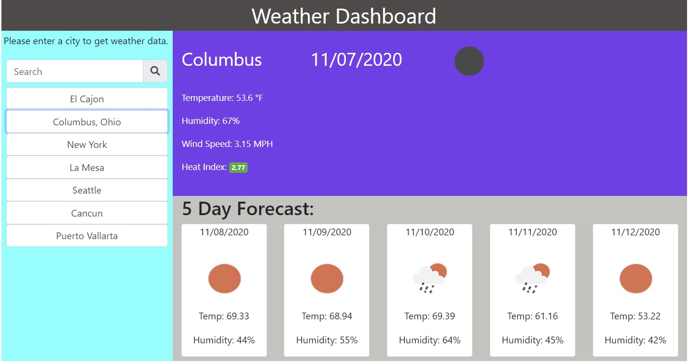

# weather-dashboard

## Description
For this weather dashboard project, I had to created a weather app from scratch to display the weather for the city typed in by the user. The weather dashboard performed the following tasks.
    <ul>
        <li>Asked for city from the user.</li>
        <li>Displayed the weather for the current day as well as the 5 day forecast.</li>
        <li>Changed the color of the heat index (UVI) badge based on whether it was favorable (green), moderate (yellow), or severe (red).</li>
        <li>For each city entered, add it to the city search history list.</li>
        <li>For any city clicked on in the city search history list, display the weather data on the dashboard again.</li>
        <li>Save cities entered by the user (the city search history list) to local storage.</li>
        <li>Upon first launch ask the user for permission to access their current location to display their weather data in the dashboard.</li>
    </ul>
    
This was accomplished by: 
    <ul>
        <li>Using the Open Weather API to get weather data for specific cities</li>
        <li>Using jQuery to manipulate the DOM of the index.html.</li>
        <li>Using moment.js to update the date to the current date and the dates in the five day forecast</li>
        <li>Using jQuery on clicks for the city input button and the city search history buttons.</li>
        <li>Using functions to:</li>
        <li>Get user's current location upon first launch of the weather dashboard.</li>
        <li>After getting user's current location, use lat and long to get city name from Open Weather API.</li>
        <li>Add entered city by user to the city search history list.</li>
        <li>Store city search history in local storage.</li>
        <li>Retrieve and render city search history from local storage.</li>
        <li>Get current weather using Open Weather API.</li>
        <li>Get heat index using Open Weather API.</li>
        <li>Get 5 day forecast using Open Weather API.</li>
    </ul>

## Technologies Used
<ul>
    <li>APIs/AJAX Calls</li>
    <li>HTML</li>
    <li>CSS</li>
    <li>jQuery</li>
    <li>Moment.js</li>
    <li>DOM Manipulation</li>
    <li>Functions</li>
    <li>Local Storage</li>
</ul>

## What I Learned

While working on this project, I learned how to use AJAX to access weather information from the Open Weather API. I also learned how to use getLocation to get the user's current location. This wasn't a requirement for the project. However, I didn't like that the weather dashboard was blank when it was first launched. So I didn't a little research and figured out how retrieve the lat and long for the user's current location. I then had to take the lat and long and send it to the Open Weather API to get the name attached to the lat and long. Because this project was built from scratch, it required a lot of psuedo-coding. Pseudo-coding helped tremendously as I worked through coding each of the different functions and features of the weather-dashboard.

## Link to weather dashboard:
https://cdrobinsoniii.github.io/weather-dashboard/